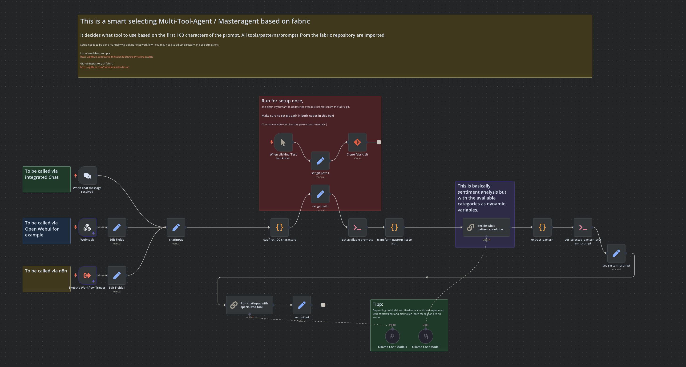

# This is a smart selecting Multi-Tool-Agent / Masteragent based on fabric

Introducing an intelligent AI agent designed to seamlessly navigate complex tasks by automatically selecting the optimal tool based on the first 100 characters of any given prompt. By leveraging the full power of the Fabric repository, this agent integrates diverse AI tools, patterns, and prompts to tackle challenges efficiently. Setup is a breeze through the "Test workflow" button, although some fine-tuning of directory paths and permissions may be required.

Behind the scenes, Fabric revolutionizes the way AI is integrated into our lives. Unlike traditional AI systems, which struggle with applicability, Fabric breaks down complex problems into manageable components. It provides granular control, allowing users to apply AI to specific aspects of their daily tasks. With Fabric, AI becomes a powerful, flexible tool to solve real-world challenges, enhancing human productivity and well-being.

(Setup needs to be done manually via clicking "Test workflow". You may need to adjust directory and or permissions.)

List of available prompts:
https://github.com/danielmiessler/fabric/tree/main/patterns

Github Repository of fabric:
https://github.com/danielmiessler/fabric

Not:
This is still work in progress.
